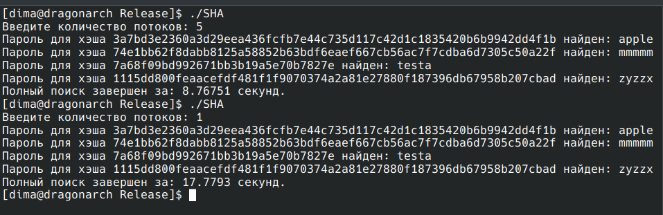

Программа для перебора пятизначных паролей использующих MD5 и SHA-256. Код легко модифируется, можно добавить другие типы хэширования, изменить длину пароля и т.п.

Файл может требовать модификации на некоторых ОС, т.к. необходимо ставить openssl.
Windows либо через инсталятов, либо ручной curl. Linux  через установку пакета.

Весь код можно запустить в IDE, но для эффективной работы необходимо сделать Release.

mkdir Release
cd Release
cmake -DCMAKE_BUILD_TYPE=Release ..
make

Должна быть папка build. В неё уже необходимо скинуть файл hash.txt (хэши из примера). Собранный проект называется SHA.

